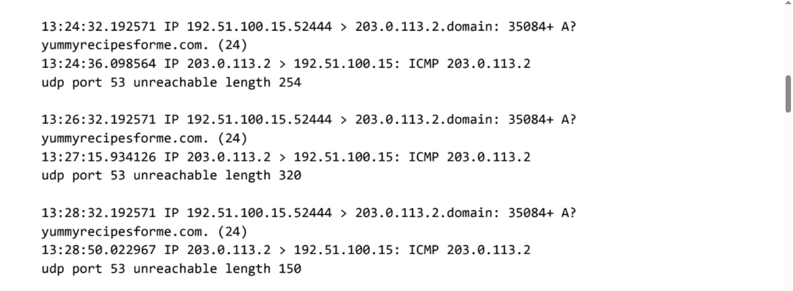

# Analyze Network Layer Communication

This project focuses on analyzing DNS and ICMP traffic using **tcpdump** to identify potentially malicious activity at the **Internet Layer** of the TCP/IP model.

---

## Case Scenario

You are a cybersecurity analyst working at a company that specializes in providing IT services for clients. Several customers of one of your clients reported that they were not able to access the client company's website — **www.yummyrecipesforme.com** — and received the error:

> “Destination port unreachable”

You attempt to visit the website yourself and receive the same error.

To troubleshoot the issue, you open **tcpdump** and try loading the webpage again. Here's what happens:

- Your browser sends a DNS query using the **UDP protocol** to retrieve the IP address of the domain.
- It then uses this IP address to send an **HTTPS request** to the web server.
- However, the network analyzer shows that when you send UDP packets to the DNS server, you receive **ICMP packets** containing the error message:

> “udp port 53 unreachable”

## 📷 Packet Capture Evidence

Below is a tcpdump output showing repeated DNS queries and ICMP "port 53 unreachable" responses:



Your task is to analyze the network communication and determine:
- Which network protocol was affected
- Why the destination port is unreachable
- What anomalies or misconfigurations may be present

---

## Objective

- Capture and inspect DNS and ICMP packets using tcpdump  
- Identify protocols involved in a simulated cybersecurity incident  
- Analyze IP datagrams to detect suspicious patterns or anomalies

---

## Tools Used

- **tcpdump** – for capturing and analyzing raw network traffic  
- *(Optional)* Wireshark – for graphical packet inspection

---

# 🧾 Network Traffic Analysis Report

## 🔐 Cybersecurity Incident Report

### Part 1: Summary of the Problem

As part of the DNS protocol, the browser used the **UDP protocol** to query the DNS server for the IP address of `yummyrecipesforme.com`. However, the DNS server responded with an **ICMP error**, indicating a failure to establish contact.

In the tcpdump logs:
- The **outgoing UDP messages** from the browser to the DNS server appear in the first two lines of each log event.
- The **ICMP error responses** — specifically stating `udp port 53 unreachable` — are shown in the third and fourth lines.

Since **port 53** is designated for DNS traffic, this clearly points to a problem with the DNS server. The presence of DNS-specific flags such as:
- A **plus sign (`+`)** following the query ID `35084`
- The `"A?"` (indicating a request for an A record)

... further confirms that DNS resolution was attempted.

> 💡 Based on the ICMP errors and DNS indicators, it's highly likely that the DNS server is either **down** or **not responding** to queries.

---

### Part 2: Analysis and Possible Cause

The incident occurred today at **1:24 p.m.**, when customers reported receiving a **“destination port unreachable”** error while attempting to access the website `yummyrecipesforme.com`.

The **cybersecurity team** supporting the client organization launched an immediate investigation to restore access.

Using `tcpdump` for **packet sniffing**, we observed that:
- **DNS traffic** to port 53 was unreachable.

This indicates a problem with the **DNS server**, possibly due to:
- The DNS server being **offline**
- A **firewall** blocking UDP traffic to **port 53**

#### ✅ Possible Causes:
- A successful **Denial of Service (DoS) attack**
- A **misconfiguration** on the DNS server or firewall rules

---


## Example tcpdump Commands

```bash
# Capture all ICMP packets
sudo tcpdump -i eth0 icmp

# Capture DNS queries (port 53)
sudo tcpdump -i eth0 port 53

# Verbose capture with hex/ASCII output
sudo tcpdump -nn -vvv -X -s 0 -c 100


/screenshots/     → tcpdump command output images (.png, .jpg)
/notes/           → written findings, summaries, or incident reports
/README.md        → project overview and documentation
/LICENSE          → project licensing (MIT)
